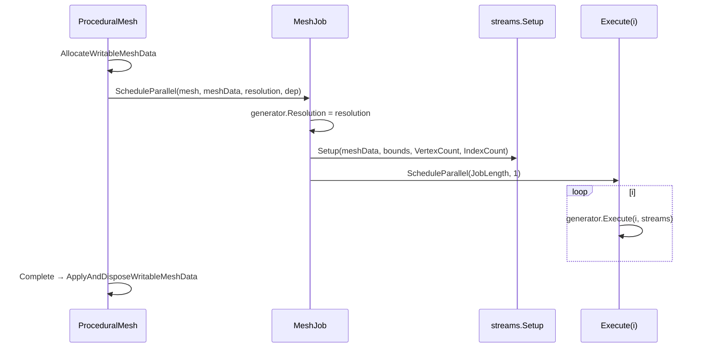

# Day02 — 程序化网格框架：设计思路与代码详解

本文档面向 **`ProceduralMeshes/`** 源码本身：先说明**为什么这样分层与设计**，再按文件**对照代码**走读。操作步骤、依赖包与踩坑索引见同目录 **`README.md`**。

---

## 一、设计思路

### 1.1 要解决什么问题？

程序化网格有两类「关心点」往往纠缠在一起：

1. **几何与拓扑**：这一块 quad 的四个角在哪、UV 怎么铺、三角形绕序怎样——本质是算法。
2. **GPU 顶点格式**：position/normal/tangent/uv 是**交错单缓冲**还是**多流拆分**、索引是 16 位还是 32 位——本质是内存布局与 `Mesh.MeshData` 的配置细节。

若把二者写死在同一个 Job 里，每次换布局都要复制一套几何代码；反之亦然。本框架把两类逻辑**拆开**，让「生成器」只认识统一的逻辑顶点类型，「流」专门负责**如何把 `Vertex` 写进 `MeshData`**。

### 1.2 三层结构：生成器 / 流 / Job

| 层 | 角色 | 要点 |
|----|------|------|
| **`IMeshGenerator`** | 几何与拓扑 | 只调用 `SetVertex` / `SetTriangle`，使用 **`Vertex`**。 |
| **`IMeshStreams`** | 缓冲布局与写入 | `Setup` 声明属性流与索引格式；`Set*` 写入 `NativeArray` 视图。 |
| **`MeshJob<G, S>`** | 并行调度 | Burst `IJobFor`，把下标 `i` 交给 `generator.Execute(i, streams)`。 |

**`ProceduralMesh`** 不属于框架核心：它是场景侧的「胶水」，负责 **`AllocateWritableMeshData` → 调度 → `ApplyAndDisposeWritableMeshData`**，放在全局命名空间只为 Inspector 里与其它教程脚本风格一致。

### 1.3 为什么用「泛型 struct + 接口约束」？

- **`G : struct, IMeshGenerator`**、**`S : struct, IMeshStreams`**：`MeshJob` 在编译期绑定到**具体的 struct**（如 `SquareGrid` + `MultiStream`），Burst 更容易做内联与优化，避免「运行时接口分发」的开销与限制。
- **`Execute<S>(…)`** 把流类型泛型化：生成器同一份代码可同时适配 **`SingleStream`** 与 **`MultiStream`**，无需为每种流写一个生成器副本。

### 1.4 几个关键工程权衡

**（1）逻辑顶点 `Vertex` vs 物理布局 `Stream0`**

```5:10:f:/Eriuka/ChunkTest/Assets/MeshBaseGame/LearnMesh/Day02/ProceduralMeshes/Vertex.cs
    public struct Vertex
    {
        public float3 position, normal;
        public float4 tangent;
        public float2 texCoord0;
    }
```

生成器只依赖 **`Vertex`**。若将来要把部分属性改成半精度或打包，`SingleStream` 里改 **`Stream0` + `SetVertex` 映射**即可；生成器若仍输出 **`Vertex`**，可保持不变。  
`SingleStream` 内再用 **`[StructLayout(LayoutKind.Sequential)]`** 固定 **`Stream0`** 字段顺序，保证与 `VertexAttributeDescriptor` 声明的顺序一致。

**（2）`[NativeDisableContainerSafetyRestriction]`**

顶点缓冲与索引缓冲都来自同一块 **`MeshData`** 底层内存的不同区间；Unity 的安全系统可能把它们视为**潜在别名**而拒绝并行访问。教程与本项目在确认「顶点区与索引区不重叠」的前提下，对 **`stream0`**（或各 stream）与 **`triangles`** 两个 **`NativeArray`** 视图关闭该项检查；否则会出现「两个容器可能是同一件事」之类的异常。

**（3）`MeshUpdateFlags.DontRecalculateBounds | DontValidateIndices`**

在 **`Setup` 里调用 `SetSubMesh` 时，Job 尚未写入索引**，缓冲区内容无效。若走默认校验，很容易在调度前就失败。标志位的含义是：**暂不根据缓冲区内容验证索引或重算包围体**；合法范围改由生成器提供的 **`Bounds`** 与子网格描述 **显式约定**。

**（4）16 位索引与 `TriangleUInt16`**

索引缓冲按 **`ushort`** 分配，三角形用顺序布局的三个 **`ushort`** 作为一个写入单元；`Reinterpret<TriangleUInt16>(2)` 中 **`2`** 表示每个 **`ushort` 占 2 字节**，三个组成一个三角形记录。生成器侧仍用 **`int3`**，通过隐式转换落到 **`ushort`**。

**（5）`[WriteOnly] S streams`**

提示 Job System：该 Job **只写入**网格缓冲，便于依赖分析与优化。

**（6）`SquareGrid` 中 `JobLength = Resolution`（按行并行）**

每个 **`Execute(z, …)`** 处理固定 **`z`** 下 **`x = 0 … Resolution-1`** 的一整行 quad，在循环内递增 **`vi` / `ti`**。相比「每个 quad 一个 Job」，调度次数从 **R²** 降为 **R**，框架开销更小；Burst 仍可对行内循环做优化。

**（7）`MeshJob.ScheduleParallel` 里的赋值顺序**

先 **`job.generator.Resolution = resolution`**，再读 **`VertexCount` / `IndexCount` / `Bounds`** 并调用 **`streams.Setup`**；否则计数仍按默认分辨率计算，会与实际写入不一致。

---

## 二、代码详解（按文件）

### 2.1 `Vertex.cs`

```5:10:f:/Eriuka/ChunkTest/Assets/MeshBaseGame/LearnMesh/Day02/ProceduralMeshes/Vertex.cs
    public struct Vertex
    {
        public float3 position, normal;
        public float4 tangent;
        public float2 texCoord0;
    }
```

- 使用 **`Unity.Mathematics`** 类型，便于 Burst 与 SIMD。
- 与常见着色器输入对齐：`POSITION`、`NORMAL`、`TANGENT`、`TEXCOORD0`。

### 2.2 `IMeshStreams.cs`

```6:13:f:/Eriuka/ChunkTest/Assets/MeshBaseGame/LearnMesh/Day02/ProceduralMeshes/IMeshStreams.cs
    public interface IMeshStreams
    {
        void Setup(Mesh.MeshData meshData, Bounds bounds, int vertexCount, int indexCount);

        void SetVertex(int index, Vertex data);

        void SetTriangle(int index, int3 triangle);
    }
```

- **`Setup`**：一次性配置 **`MeshData`**（顶点缓冲布局、索引格式、子网格），并缓存 **`GetVertexData` / `GetIndexData`** 得到的 **`NativeArray`** 视图。
- **`bounds`**：写入 **`SubMeshDescriptor`**，与 **`Mesh.bounds`** 一致化（由调度侧传入）。
- **`SetTriangle`**：第二个参数为 **`int3`**，表示一个三角形的三个**顶点索引**，写起来比裸 **`ushort`** 更符合几何直觉。

### 2.3 `IMeshGenerator.cs`

```5:18:f:/Eriuka/ChunkTest/Assets/MeshBaseGame/LearnMesh/Day02/ProceduralMeshes/IMeshGenerator.cs
    public interface IMeshGenerator
    {
        void Execute<S>(int i, S streams) where S : struct, IMeshStreams;

        int VertexCount { get; }

        int IndexCount { get; }

        int JobLength { get; }

        Bounds Bounds { get; }

        int Resolution { get; set; }
    }
```

- **`VertexCount` / `IndexCount`**：必须与 **`Setup`** 申请的长度一致，且覆盖 **`Execute`** 中出现的最大顶点/三角形索引。
- **`JobLength`**：**`IJobFor`** 的并行长度；含义由生成器定义（如 **`SquareGrid`** 里 **`i` = 行号 `z`**）。
- **`Resolution`**：本示例网格用；其它生成器若不需要，仍可保留属性并在内部忽略或固定语义。

### 2.4 `MeshJob.cs`

```8:36:f:/Eriuka/ChunkTest/Assets/MeshBaseGame/LearnMesh/Day02/ProceduralMeshes/MeshJob.cs
    [BurstCompile(FloatPrecision.Standard, FloatMode.Fast, CompileSynchronously = true)]
    public struct MeshJob<G, S> : IJobFor
        where G : struct, IMeshGenerator
        where S : struct, IMeshStreams
    {
        public G generator;

        [WriteOnly]
        public S streams;

        public void Execute(int i) => generator.Execute(i, streams);

        public static JobHandle ScheduleParallel(
            Mesh mesh,
            Mesh.MeshData meshData,
            int resolution,
            JobHandle dependency
        )
        {
            var job = new MeshJob<G, S>();
            job.generator.Resolution = resolution;
            job.streams.Setup(
                meshData,
                mesh.bounds = job.generator.Bounds,
                job.generator.VertexCount,
                job.generator.IndexCount
            );
            return job.ScheduleParallel(job.generator.JobLength, 1, dependency);
        }
    }
```

- **`BurstCompile(..., CompileSynchronously = true)`**：编辑器下首次编译更可预测；可按项目改为异步编译。
- **`Execute`**：零开销转发到 **`generator.Execute`**。
- **`mesh.bounds = job.generator.Bounds`**：利用赋值表达式结果作为 **`Setup`** 的 **`bounds`** 实参，同时设置 **`Mesh`** 的世界空间包围盒。
- **`ScheduleParallel(..., innerloopBatchCount: 1, …)`**：每个并行迭代一个 **`Execute`**；是否改为更大 batch 取决于 Profiler。

### 2.5 `Streams/TriangleUInt16.cs`

```6:17:f:/Eriuka/ChunkTest/Assets/MeshBaseGame/LearnMesh/Day02/ProceduralMeshes/Streams/TriangleUInt16.cs
    [StructLayout(LayoutKind.Sequential)]
    public struct TriangleUInt16
    {
        public ushort a, b, c;

        public static implicit operator TriangleUInt16(int3 t) => new TriangleUInt16
        {
            a = (ushort)t.x,
            b = (ushort)t.y,
            c = (ushort)t.z
        };
    }
```

- 与 **`ushort`** 索引缓冲的字节布局一致，便于 **`SetTriangle`** 一次写一个三角形。
- 隐式转换把 **`int3`** 转为三角形；超大顶点索引会截断——本示例 **`Resolution ≤ 10`** 远小于 65535。

### 2.6 `Streams/SingleStream.cs`（要点摘录）

- **`Stream0`**：与 **`Vertex`** 字段顺序一致，**`Sequential`** 保证与 descriptor 顺序匹配。
- **`SetVertexBufferParams`** 后 **`descriptor.Dispose()`**：临时 **`NativeArray`** 立即释放。
- **`SetIndexBufferParams(..., IndexFormat.UInt16)`** 与 **`GetIndexData<ushort>().Reinterpret<TriangleUInt16>(2)`** 配套。
- **`SetSubMesh`**：传入 **`bounds`、`vertexCount`**，并带上 **`DontRecalculateBounds | DontValidateIndices`**。
- **`AggressiveInlining`**：减少 **`SetVertex`** 在小循环里的调用开销，利于 Burst 内联整块写入逻辑。

完整实现见：

```12:67:f:/Eriuka/ChunkTest/Assets/MeshBaseGame/LearnMesh/Day02/ProceduralMeshes/Streams/SingleStream.cs
    public struct SingleStream : IMeshStreams
    {
        [StructLayout(LayoutKind.Sequential)]
        struct Stream0
        {
            public float3 position, normal;
            public float4 tangent;
            public float2 texCoord0;
        }

        [NativeDisableContainerSafetyRestriction]
        NativeArray<Stream0> stream0;

        [NativeDisableContainerSafetyRestriction]
        NativeArray<TriangleUInt16> triangles;

        public void Setup(Mesh.MeshData meshData, Bounds bounds, int vertexCount, int indexCount)
        {
            // ... descriptor、UInt16 索引、SetSubMesh、GetVertexData / GetIndexData ...
        }

        [MethodImpl(MethodImplOptions.AggressiveInlining)]
        public void SetVertex(int index, Vertex vertex) => stream0[index] = new Stream0 { ... };

        [MethodImpl(MethodImplOptions.AggressiveInlining)]
        public void SetTriangle(int index, int3 triangle) => triangles[index] = triangle;
    }
```

### 2.7 `Streams/MultiStream.cs`（要点摘录）

- 四个 **`VertexAttributeDescriptor`** 分别指定 **`stream: 0..3`**，与 **`GetVertexData<T>(streamIndex)`** 一一对应。
- **`SetVertex`** 把逻辑 **`Vertex`** 拆写到四路 **`NativeArray`**；拓扑与 **`SingleStream`** 相同，仅布局不同。

```25:54:f:/Eriuka/ChunkTest/Assets/MeshBaseGame/LearnMesh/Day02/ProceduralMeshes/Streams/MultiStream.cs
        public void Setup(Mesh.MeshData meshData, Bounds bounds, int vertexCount, int indexCount)
        {
            // descriptor[1..3] 显式 stream: 1,2,3
            // ...
            stream0 = meshData.GetVertexData<float3>();
            stream1 = meshData.GetVertexData<float3>(1);
            stream2 = meshData.GetVertexData<float4>(2);
            stream3 = meshData.GetVertexData<float2>(3);
            triangles = meshData.GetIndexData<ushort>().Reinterpret<TriangleUInt16>(2);
        }
```

### 2.8 `Generators/SquareGrid.cs`

```10:54:f:/Eriuka/ChunkTest/Assets/MeshBaseGame/LearnMesh/Day02/ProceduralMeshes/Generators/SquareGrid.cs
        public int Resolution { get; set; }

        public int VertexCount => 4 * Resolution * Resolution;

        public int IndexCount => 6 * Resolution * Resolution;

        public int JobLength => Resolution;

        public Bounds Bounds => new Bounds(Vector3.zero, new Vector3(1f, 0f, 1f));

        public void Execute<S>(int z, S streams) where S : struct, IMeshStreams
        {
            int vi = 4 * Resolution * z;
            int ti = 2 * Resolution * z;
            // 每行：固定 normal、tangent；zCoordinates 提出循环外；x 循环内写 4 顶点 + 2 三角形
        }
```

- **`VertexCount`**：每格 4 顶点，共 **R²** 格。
- **`IndexCount`**：每格 2 三角形 × 3 索引 × **R²**。
- **XZ 平面**：写 **`position.x` / `position.z`**，**`normal.y = 1`**。
- **居中单位平面**：**`(x, z)`** 与 **`(x+1, z+1)`** 归一化到 **[-0.5, 0.5]** 附近（通过 **`/ Resolution - 0.5f`**）。
- **绕行顺序**：**`(0,2,1)`** 与 **`(1,2,3)`** 与常见 quad 三角剖分一致（具体绕向与正面剔除相关，需与材质双面/剔除一致）。
- **`vertex.tangent.xw = float2(1f, -1f)`**：对齐右手切线空间常用的 **`float4(t.xyz, sign)`** 打包习惯（**w** 为副切线方向 handedness）。

### 2.9 `ProceduralMesh.cs`

```14:37:f:/Eriuka/ChunkTest/Assets/MeshBaseGame/LearnMesh/Day02/ProceduralMeshes/ProceduralMesh.cs
    void Awake()
    {
        mesh = new Mesh { name = "Procedural Mesh" };
        GetComponent<MeshFilter>().mesh = mesh;
    }

    void OnValidate() => enabled = true;

    void Update()
    {
        GenerateMesh();
        enabled = false;
    }

    void GenerateMesh()
    {
        Mesh.MeshDataArray meshDataArray = Mesh.AllocateWritableMeshData(1);
        Mesh.MeshData meshData = meshDataArray[0];

        MeshJob<SquareGrid, MultiStream>.ScheduleParallel(mesh, meshData, resolution, default)
            .Complete();

        Mesh.ApplyAndDisposeWritableMeshData(meshDataArray, mesh);
    }
```

- **`OnValidate` → `enabled = true`**：Inspector 改 **`resolution`** 时启用组件。
- **`Update` 内生成后 `enabled = false`**：避免每帧重建；仅在参数变化导致的启用那一帧执行 **`GenerateMesh`**。
- **`Complete()`**：主线程阻塞等待 Job 结束，随后 **`ApplyAndDisposeWritableMeshData`** 才把数据提交到 **`Mesh`** 实例。

---

## 三、附录：运行时顺序（简图）



---

## 四、延伸阅读

- 同目录 **`README.md`**：`NativeArray`/Burst/Job 概念、`ProceduralMesh` 使用步骤、踩坑列表、单流/多流对比表。
